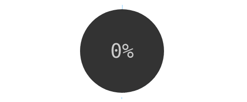

# Circular-progress-bar
[](https://www.npmjs.com/package/circular-progress-bar)
[](https://www.npmjs.com/package/circular-progress-bar)
[](https://packagephobia.now.sh/result?p=circular-progress-bar)
[](https://www.patreon.com/gmartigny)



CSS circular progress bar.

## Installation

    npm install circular-progress-bar


## Usage

Once installed, add it to your project with common.js or ES6 syntax :

```js
const CircularProgressBar = require("circular-progress-bar");
// or
import CircularProgressBar from "circular-progress-bar";
```

Then, you can start to use it on your code :

```js
const options = {
    size: 200,
    background: "transparent"
};
const progress = new CircularProgressBar(42, options);
progress.appendTo(document.body);
```

Since today's web browser don't support module requirements yet, you need to use a bundler like [webpack](https://webpack.js.org/) or [browserify](http://browserify.org/).

This module need its style, so your build chain need to be able to deal with CSS file import.


## CDN

If you have no build tool, you can directly fetch it from CDN.

```html
<script src="https://circular-progress-bar.now.sh"></script>

<script>
    const gauge = new CircularProgressBar();
</script>
```


## Documentation

Check the [full documentation](documentations.md) or [some examples](https://circular-progress-bar.now.sh/examples).


## License

[MIT](license)
